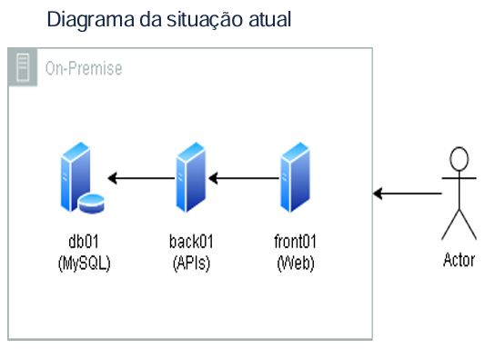

# Projeto Final Da Turma de NOV_2024 
Projeto Cloud AWS - Trilha DevSecOps do programa de bolsas da empresa compass.uol 

## 👥 Dupla
- Maria Luiza Nascimento De Brito Araújo
- Matheus De Miranda Mendonça

## 💡 Case - Problema a ser solucionado

Nós somos da empresa "Fast Engineering S/A" e gostaríamos de uma solução dos senhores(as), que fazem parte da empresa terceira "TI SOLUÇÕES INCRÍVEIS". Nosso eCommerce está crescendo e a solução atual não está atendendo mais a alta demanda de acessos e compras que estamos tendo. 

## 🎯 Objetivos principais
- Realizar a migração do ambiente abaixo para AWS, seguindo as melhores práticas da arquitetura em Cloud AWS

## 	:mag_right: ÍNDICE
1. [Lift and Shift](#1-Lift-and-Shift)
* [Atividades necessárias](#11-atividades-necessárias)
* [Ferramentas utilizadas](#12-ferramentas-utilizadas)
* [Diagrama As-Is](#13-diagrama-lift-and-shift)
* [Segurança](#14-segurança)
* [Backup](#15-backup)
* [Custo da Infraestrutura](#16-aws-pricing)
2. [Modernização/Kubenets](#2-kubenets)
*  [Atividades necessárias](#21-atividades-necessárias)
* [Ferramentas utilizadas](#22-ferramentas-utilizadas)
* [Diagrama](#23-diagrama-kubernets)
* [Segurança](#24-segurança)
* [Backup](#25-backup)
* [Custo da Infraestrutura](#26-aws-pricing)

## 1. Lift and Shift
Lift and shift, também conhecida como “rehosting” consiste em migrar uma aplicação de um ambiente para outro, sem grandes mudanças. No projeto, o ambiente on-premises da empresa "Fast Engineering S/A" vai ser migrado para a AWS.

## 1.1 Atividades necessárias
- Analisar a Infraestrutura atual

- Migração do Banco de Dados
    - Criar e configurar Amazon RDS para MySQL
    - Configuração do Amazon DMS (Database Migration Service)

- Migração do Frontend:
    - Criar e configurar Amazon S3 para armazenamento de estáticos
    - Fazer upload dos arquivos do React para o bucket S3
    - Criar e configurar um CloudFront para o bucket
    - Configurar DNS

- Migração do backend
    - Instale o Replication Agent no servidor de backend local.
    - Configure o Amazon MGN para replicar o servidor de backend para a AWS.
    - Configure EC2 e o armazenamento de objetos

- Preparação do ambiente na AWS:
    - Configurar networking -> VPC para isolar os recursos
    - Configurar security groups para controle de tráfego
    - Configurar IAM para controlar o acesso aos recursos da AWS

-  Finalizar a migração => Corte
    - Atualize o registro do DNS
    - Realize o Backup completo do ambiente on-premises antes de desativá-lo
    - Monitoramento com CloudWatch
    - Desative os servidores antigos

### 1.2 Ferramentas utilizadas

- AWS MGN (Application Migration Service) -> Serviço da Amazon para automatizar a migração Lift and Shift de servidores. Documentação: https://docs.aws.amazon.com/mgn/latest/ug/what-is-application-migration-service.html
- AWS DMS (Database Migration Service) -> Utilizado para migrar dados em um banco on-premises para o RDS. Documentação: https://docs.aws.amazon.com/dms/latest/userguide/Welcome.html
- AWS RDS (Relational Database Service) -> Banco de dados relacional de gerenciamento fácil. Documentação: https://docs.aws.amazon.com/AmazonRDS/latest/UserGuide/Welcome.html
- Amazon EC2 (Elastic Compute Cloud ) -> Disponibiliza o acesso sob demanda e escalável de capacidade de computação, reduzindo os custos com hardware. Documentação: https://docs.aws.amazon.com/AWSEC2/latest/UserGuide/concepts.html
- AWS S3 ( Amazon Simple Storage Service) -> Serviço de armazenamento de objetos. Documentação: https://docs.aws.amazon.com/AmazonS3/latest/userguide/Welcome.html
- Amazon CloudFront -> Acelera a distribuição de arquivos estáticos. Documentação: https://docs.aws.amazon.com/AmazonCloudFront/latest/DeveloperGuide/Introduction.html
- Amazon CloudWatch -> Monitoramento recursos e as aplicações em tempo real na infraestrutura AWS. Documentação: https://docs.aws.amazon.com/AmazonCloudWatch/latest/monitoring/WhatIsCloudWatch.ht
- Amazon Backup -> Permite configurar políticas de backup e monitorar a atividade de recursos na AWS. Documentação: https://docs.aws.amazon.com/aws-backup/latest/devguide/whatisbackup.html
- Amazon VPC (Virtual private cloud) -> Utilizada para isolamento e segurança de rede, semelhante a rede tradicional. Documentação: https://docs.aws.amazon.com/vpc/latest/userguide/what-is-amazon-vpc.html
- IAM (AWS  Identity and Access Management ) -> É um serviço que permite gerenciar usuários, credenciais de segurança que controlam quais usuário e aplicações podem acessar os recursos da AWS. Documentação: https://docs.aws.amazon.com/IAM/latest/UserGuide/introduction.html
- Security Groups -> Configuração de segurança e controle de acesso.
- AWS Pricing Calculator -> Ferramenta da AWS Billing and Cost Management que permite estimar os custos da arquitetura. Documentação: https://docs.aws.amazon.com/cost-management/latest/userguide/pricing-calculator.html

### 1.3 Diagrama Lift and Shift

### 1.4 Segurança

- VPC com subnet privadas e pública
- Banco de dados - RDS em subnet privada
- Security group limitando o tráfego
- IAM para limitar acesso aos recursos da AWS
- Criptografia em repouso KMS para RDS e SSE-S3 (Sem custo adicional) para Amazon S3
    - Criptografia em trânsito TLS para RDS e HTTPS para S3

### 1.5 Backup
- AWS backups para EC2
- RDS ->backups automatizados
- S3 -> Replication/Versionamento + Ciclo de Vida do S3/Lifecycle Policy

### 1.6 Custo de infraestrutura

### 2. Kubernets

### 2.1 Atividades necessárias

### 2.2 Ferramentas utilizadas

### 2.3 Diagrama Kubernets

### 2.4 Segurança

### 2.5 Backup

### 2.6 AWS Pricing

