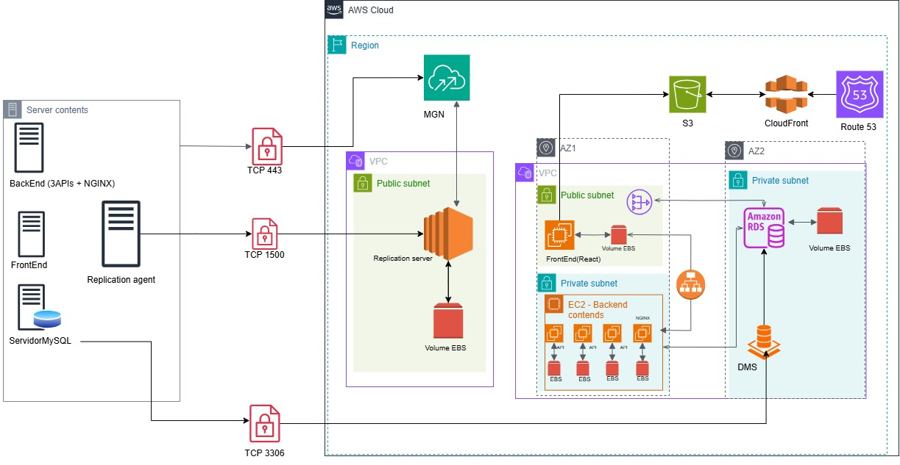
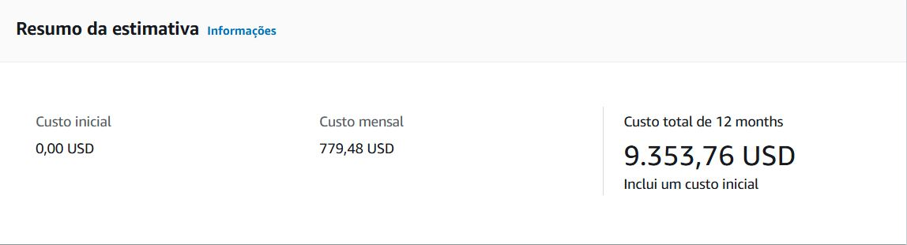

# Projeto Final Da Turma de NOV_2024 
Projeto Cloud AWS - Trilha DevSecOps do programa de bolsas da empresa compass.uol 

## 👥 Dupla
- Maria Luiza Nascimento De Brito Araújo
- Matheus De Miranda Mendonça

## 💡 Case - Problema a ser solucionado

Nós somos da empresa "Fast Engineering S/A" e gostaríamos de uma solução dos senhores(as), que fazem parte da empresa terceira "TI SOLUÇÕES INCRÍVEIS". Nosso eCommerce está crescendo e a solução atual não está atendendo mais a alta demanda de acessos e compras que estamos tendo. 

## 🎯 Objetivos principais
- Realizar a migração do ambiente abaixo para AWS, seguindo as melhores práticas da arquitetura em Cloud AWS

## 	:mag_right: ÍNDICE
1. [Lift and Shift](#1-lift-and-shift)
* [Atividades necessárias](#11-atividades-necessárias-para-a-migração)
* [Ferramentas utilizadas](#12-ferramentas-utilizadas)
* [Diagrama As-Is](#13-diagrama-lift-and-shift)
* [Segurança](#14-segurança)
* [Backup](#15-backup)
* [Custo da infraestrutura](#16-custo-de-infraestrutura)
2. [Modernização com EKS (Elastic Kubernetes Service)](#2-modernização-com-eks-elastic-kubernetes-service)
* [Atividades necessárias](#21-atividades-necessárias-para-a-migração)
* [Ferramentas utilizadas](#22-ferramentas-utilizadas)
* [Diagrama da modernização](#23-diagrama-kubernets)
* [Garantia dos requisitos de segurança](#24-garantia-dos-requisitos-de-segurança)
* [Containerização das aplicações](#25-containerização-das-aplicações)
* [Segurança e monitoramento](#26-segurança-e-monitoramento)
* [Backup](#27-backup)
* [Custo da infraestrutura](#28-aws-pricing)

# 1. Lift and Shift
Lift and shift, também conhecida como “rehosting” consiste em migrar uma aplicação de um ambiente para outro, sem grandes mudanças. No projeto, o ambiente on-premises da empresa "Fast Engineering S/A" vai ser migrado para a AWS.

## 1.1 Atividades necessárias para a migração
- Analisar a Infraestrutura atual

- Preparação do ambiente na AWS:
    - Configurar networking -> VPC para isolar os recursos

- Migração do Banco de Dados
    - Criar e configurar Amazon RDS para MySQL
    - Configuração do Amazon DMS (Database Migration Service)

- Migração do Frontend e backend
    - Instale o Replication Agent no servidor.
    - Configure o Amazon MGN para replicar o servidor para a AWS.
    - Configure EC2 e o armazenamento de objetos
    - Criar e configurar Amazon S3 para armazenamento de estáticos
    - Fazer upload dos arquivos do React para o bucket S3
    - Criar e configurar um CloudFront para o bucket
    - Configurar DNS

-  Finalizar a migração => Corte
    - Atualize o registro do DNS
    - Realize o Backup completo do ambiente on-premises antes de desativá-lo
    - Desative os servidores antigos

## 1.2 Ferramentas utilizadas

- AWS MGN (Application Migration Service) -> Serviço da Amazon para automatizar a migração Lift and Shift de servidores. Documentação: https://docs.aws.amazon.com/mgn/latest/ug/what-is-application-migration-service.html
- AWS DMS (Database Migration Service) -> Utilizado para migrar dados em um banco on-premises para o RDS. Documentação: https://docs.aws.amazon.com/dms/latest/userguide/Welcome.html
- AWS RDS (Relational Database Service) -> Banco de dados relacional de gerenciamento fácil. Documentação: https://docs.aws.amazon.com/AmazonRDS/latest/UserGuide/Welcome.html
- Amazon EC2 (Elastic Compute Cloud ) -> Disponibiliza o acesso sob demanda e escalável de capacidade de computação, reduzindo os custos com hardware. Documentação: https://docs.aws.amazon.com/AWSEC2/latest/UserGuide/concepts.html
- AWS S3 ( Amazon Simple Storage Service) -> Serviço de armazenamento de objetos. Documentação: https://docs.aws.amazon.com/AmazonS3/latest/userguide/Welcome.html
- Amazon CloudFront -> Acelera a distribuição de arquivos estáticos. Documentação: https://docs.aws.amazon.com/AmazonCloudFront/latest/DeveloperGuide/Introduction.html
- Amazon CloudWatch -> Monitoramento recursos e as aplicações em tempo real na infraestrutura AWS. Documentação: https://docs.aws.amazon.com/AmazonCloudWatch/latest/monitoring/WhatIsCloudWatch.ht
- Amazon Backup -> Permite configurar políticas de backup e monitorar a atividade de recursos na AWS. Documentação: https://docs.aws.amazon.com/aws-backup/latest/devguide/whatisbackup.html
- Amazon VPC (Virtual private cloud) -> Utilizada para isolamento e segurança de rede, semelhante a rede tradicional. Documentação: https://docs.aws.amazon.com/vpc/latest/userguide/what-is-amazon-vpc.html
- IAM (AWS  Identity and Access Management ) -> É um serviço que permite gerenciar usuários, credenciais de segurança que controlam quais usuário e aplicações podem acessar os recursos da AWS. Documentação: https://docs.aws.amazon.com/IAM/latest/UserGuide/introduction.html
- Security Groups -> Configuração de segurança e controle de acesso.
- AWS Pricing Calculator -> Ferramenta da AWS Billing and Cost Management que permite estimar os custos da arquitetura. Documentação: https://docs.aws.amazon.com/cost-management/latest/userguide/pricing-calculator.html

# 1.3 Diagrama Lift and Shift

## 1.4 Segurança

- VPC com subnet privadas e pública
- Banco de dados - RDS em subnet privada
- Security group limitando o tráfego
- IAM para limitar acesso aos recursos da AWS
- Criptografia em repouso KMS para RDS e SSE-S3 (Sem custo adicional) para Amazon S3
    - Criptografia em trânsito TLS para RDS e HTTPS para S3

## 1.5 Backup
- AWS backups para EC2
- RDS ->backups automatizados
- S3 -> Replication/Versionamento + Ciclo de Vida do S3/Lifecycle Policy

## 1.6 Custo de infraestrutura

Para visualizar informações detalhadas sobre a estimativa clique [aqui](https://github.com/mluizabrito/Projeto-Final/blob/main/Aws%20Pricing/custoAws.pdf)

# 2. Modernização com EKS (Elastic Kubernetes Service):

## Objetivos

Queremos modernizar esse sistema para **AWS**, seguindo as **melhores práticas de arquitetura em Cloud AWS**.  

A nova arquitetura deve seguir as seguintes diretrizes:

- **Alta disponibilidade**: Garantir que o sistema esteja sempre acessível, utilizando múltiplas zonas de disponibilidade (AZs).
- **Escalabilidade**: Permitir crescimento automático da infraestrutura conforme a demanda.
- **Segurança**: Aplicar boas práticas de segurança, como **IAM**, **VPCs privadas**, **WAF** e **criptografia** de dados.
- **Custo-efetividade**: Utilizar serviços gerenciados para otimizar custos operacionais.
- **Monitoramento e Logging**: Implementar **CloudWatch**, **AWS Config** e **GuardDuty** para auditoria e detecção de anomalias.
- **Automação e Infraestrutura como Código**: Provisionar recursos usando **Terraform** ou **AWS CloudFormation**.

# 2.1 Atividades Necessárias para a Migração

## 1. Preparação do Ambiente de Contêineres:
- Criar o cluster Amazon EKS com ferramentas como **eksctl**, **Terraform** ou **CloudFormation**.
- Configurar **subnets privadas** para pods sem IP público e **subnets públicas** para o **Application Load Balancer (ALB)**.
- Habilitar o **Cluster Autoscaler** para redimensionamento automático dos nós.
- Conectar a **VPC** e o **Internet Gateway** para garantir tráfego externo gerenciado pelo **ALB**.
- Criar e configurar um **Auto Scaling Group** para os **worker nodes**, definindo instâncias (ex.: `m5.large`) e associando **IAM Roles** para operações do Kubernetes.

## 2. Containerização das Aplicações:
- Criar **Dockerfiles** para as APIs backend (**Nginx** e serviços) e frontend (**React**).
- Criar repositórios no **Amazon ECR** e armazenar as imagens Docker (`docker push`).
- Configurar **variáveis de ambiente** (endpoints, credenciais no **Secrets Manager**).

## 3. Implantação das Aplicações no EKS:
- Criar arquivos **YAML (manifests)** para **Deployments, Services e Ingress**.
- Configurar o **ALB Ingress Controller** para gerenciar o tráfego externo.
- Implementar o **Horizontal Pod Autoscaler (HPA)** para escalar pods.

## 4. Integração com Persistência:
- Migrar o banco de dados para **Amazon RDS MySQL Multi-AZ** e configurar **backups automáticos**.
- Configurar **buckets no Amazon S3** para arquivos estáticos e definir políticas de acesso (**bucket policies e IAM roles**).

## 5. Pipeline de CI/CD:
- Criar pipelines com **AWS CodePipeline, CodeBuild e CodeCommit**.
- Automatizar deploys utilizando `kubectl apply` para atualizar o **cluster EKS** com novas imagens Docker.

## 6. Segurança e Monitoramento:
- Configurar **AWS WAF, IAM Roles** e criptografia (**AWS KMS**).
- Monitorar logs e métricas com **AWS CloudWatch** e ferramentas como **Prometheus e Grafana**.

## 7. Testes e Validação:
- Validar **rotas no Ingress** e testar cargas para escalar **pods e o cluster**.

# 2.2 Ferramentas utilizadas

## 1. Infraestrutura e Orquestração:
- **Amazon EKS** para Kubernetes.
- **Docker** e **Elastic Container Registry (ECR)** para contêineres e imagens.
- **Terraform, eksctl ou AWS CloudFormation** para criação do cluster e recursos.

## 2. Persistência de Dados:
- **Amazon RDS (MySQL Multi-AZ)** para o banco de dados.
- **Amazon S3** para armazenamento de arquivos estáticos.

## 3. CI/CD:
- **AWS CodePipeline, CodeBuild e CodeCommit** para automação de build e deploy.

## 4. Segurança e Monitoramento:
- **AWS WAF, Secrets Manager, IAM Roles e AWS KMS** para segurança.
- **AWS CloudWatch, Prometheus e Grafana** para monitoramento e observabilidade.

# 2.3 Diagrama Kubernets

## Descrição Textual:

### 1. **Frontend**
- Hospedado no **Kubernetes** (Amazon EKS) ou **Amazon Amplify**.

### 2. **Backend/APIs**
- Implantados no **Amazon EKS**, utilizando **Deployments e Services**.

### 3. **Banco de Dados**
- **Amazon RDS MySQL Multi-AZ** para garantir alta disponibilidade e redundância.

### 4. **Armazenamento**
- **Amazon S3** para persistência de objetos como imagens e vídeos.

### 5. **Rede**
- **Application Load Balancer (ALB)** conectado a **subnets públicas**.
- **Subnets privadas** para **worker nodes no EKS**.

### 6. **Segurança**
- **IAM Roles**, **AWS WAF** e **criptografia (AWS KMS)** para garantir comunicação segura.

## Diagrama Visual:
Para criar diagramas visuais, pode-se utilizar ferramentas como:
- **AWS Architecture Diagrams**
- **Lucidchart**
- **Draw.io (diagrams.net)**

# 2.4 Garantia dos Requisitos de Segurança

## 1. **Controle de Acesso**
- **Políticas IAM** seguindo o princípio do **menor privilégio**.
- **IAM Roles for Service Accounts (IRSA)** para pods no **Amazon EKS**.

## 2. **Proteções contra Ameaças**
- **AWS WAF** para proteção contra ataques de camada 7, como **SQL Injection (SQLi)** e **Cross-Site Scripting (XSS)**.
- **Grupos de Segurança (Security Groups)** configurados para **restringir o acesso** ao banco de dados e às APIs.

## 3. **Criptografia**
- **Dados em trânsito** protegidos com **TLS**.
- **Dados em repouso** criptografados com **AWS KMS**.

## 4. **Gerenciamento de Segredos**
- Uso do **AWS Secrets Manager** para armazenar **credenciais e tokens** com segurança.

# 2.5 Containerização das Aplicações

## Dockerization
- Criar `Dockerfile(s)` para as APIs Backend (Nginx e serviços) e o Frontend (React).
- Configurar o build das imagens usando `docker build`.

## Armazenar Imagens no Amazon ECR
- Criar repositórios no Elastic Container Registry (ECR).
- Enviar imagens para o ECR utilizando `docker push`.
- Utilizar tags para versionamento de imagens (ex.: `v1.0.0` ou `latest`).

## Configurar Variáveis de Ambiente
- Endpoints do banco de dados (RDS), URLs das APIs e credenciais seguras.
- Utilizar o Secrets Manager para evitar exposição de segredos no código.

# 2.6 Segurança e Monitoramento

## Segurança em Múltiplas Camadas
- Configurar AWS WAF para proteger contra ataques de camada 7 (SQLi, XSS).
- IAM Roles e Policies seguindo o princípio do menor privilégio.
- Criptografia de dados com AWS KMS.

## Monitoramento e Logs
- **CloudWatch Logs**: Capturar logs dos pods Kubernetes.
- **Container Insights** para métricas detalhadas.
- Adicionar ferramentas como **Prometheus** e **Grafana** para gráficos personalizados.

# 2.7 Backup

## Processo de Backup

## 1. **Banco de Dados (RDS)**
- **Backups automáticos** configurados no **Amazon RDS** com **retenção periódica**.
- **Snapshots regulares** para **restauração de dados**.

## 2. **Arquivos Estáticos (S3)**
- **Habilitação de versionamento** no **Amazon S3** para arquivos críticos, permitindo a recuperação de versões anteriores.

## 3. **Cluster Kubernetes**
- Utilização de ferramentas como **Velero** para **backup do estado do cluster**, incluindo **manifests** e **volumes**.

## 4. **Teste de Recuperação**
- Realização de **testes regulares de recuperação** para validar a eficácia dos backups e garantir que os dados podem ser restaurados corretamente.

# 2.8 AWS Pricing 

## Custo da Infraestrutura na AWS (AWS Calculator)

Os custos podem ser estimados com base nos seguintes componentes:

## 1. **Amazon EKS**
- **Taxa do cluster gerenciado** para o serviço de Kubernetes.
- **Custo das instâncias EC2** nos **worker nodes** para executar os pods.

## 2. **Amazon RDS**
- **Configuração Multi-AZ** para garantir alta disponibilidade.
- **Custos com armazenamento** (por GB) e **backups** automáticos.

## 3. **Amazon S3**
- **Custos de armazenamento** por GB.
- **Custos de tráfego de saída** para acessar os dados armazenados.

## 4. **Load Balancer**
- **Taxas de utilização** do **Application Load Balancer (ALB)**, cobradas com base na quantidade de tráfego processado.

## 5. **Ferramentas de CI/CD**
- **Custos de execução** do **AWS CodePipeline** e **CodeBuild**, cobrados de acordo com o uso das ferramentas de automação de build e deploy.

